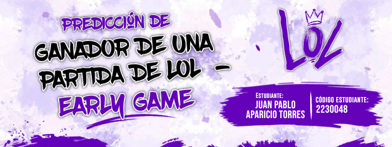

# 🎮 Predicción de Ganador de una Partida de League of Legends — Early Game

  

---

## 👤 Autores

Juan Pablo Aparicio Torres — 2230048

---

## 🎯 Objetivo

Predecir el resultado de una partida de League of Legends utilizando únicamente estadísticas de los primeros 10 minutos de juego mediante modelos de Machine Learning supervisado, Deep Learning, aprendizaje no supervisado y reducción de dimensionalidad.

---

## 📊 Dataset

| Campo | Detalle |
|---|---|
| Nombre | League of Legends Diamond Ranked Games (10 min) |
| Registros | 9.879 partidas |
| Variables | 40 columnas numéricas |
| Variable objetivo | `blueWins` (binaria: 0 = derrota, 1 = victoria) |
| Fuente | Kaggle |
| Descarga | [https://www.kaggle.com/datasets/bobbyscience/league-of-legends-diamond-ranked-games-10-min](https://www.kaggle.com/datasets/bobbyscience/league-of-legends-diamond-ranked-games-10-min) |

---

## 🤖 Modelos

`Decision Tree` `Random Forest` `SVM` `Regresión Lineal` `DNN` `BatchNormalization` `Dropout` `EarlyStopping` `K-Means` `DBSCAN` `PCA` `t-SNE`

---

## 🔗 Enlaces

| Recurso | Link |
|---|---|
| 📓 Código (Google Colab) | [Ver notebook](https://drive.google.com/file/d/1I141BPJu6EoZGK0i8BU560scC50AW0bO/view?usp=sharing) |
| 🎥 Video | [Ver en YouTube](https://youtu.be/hWRH4V0GiYI) |
